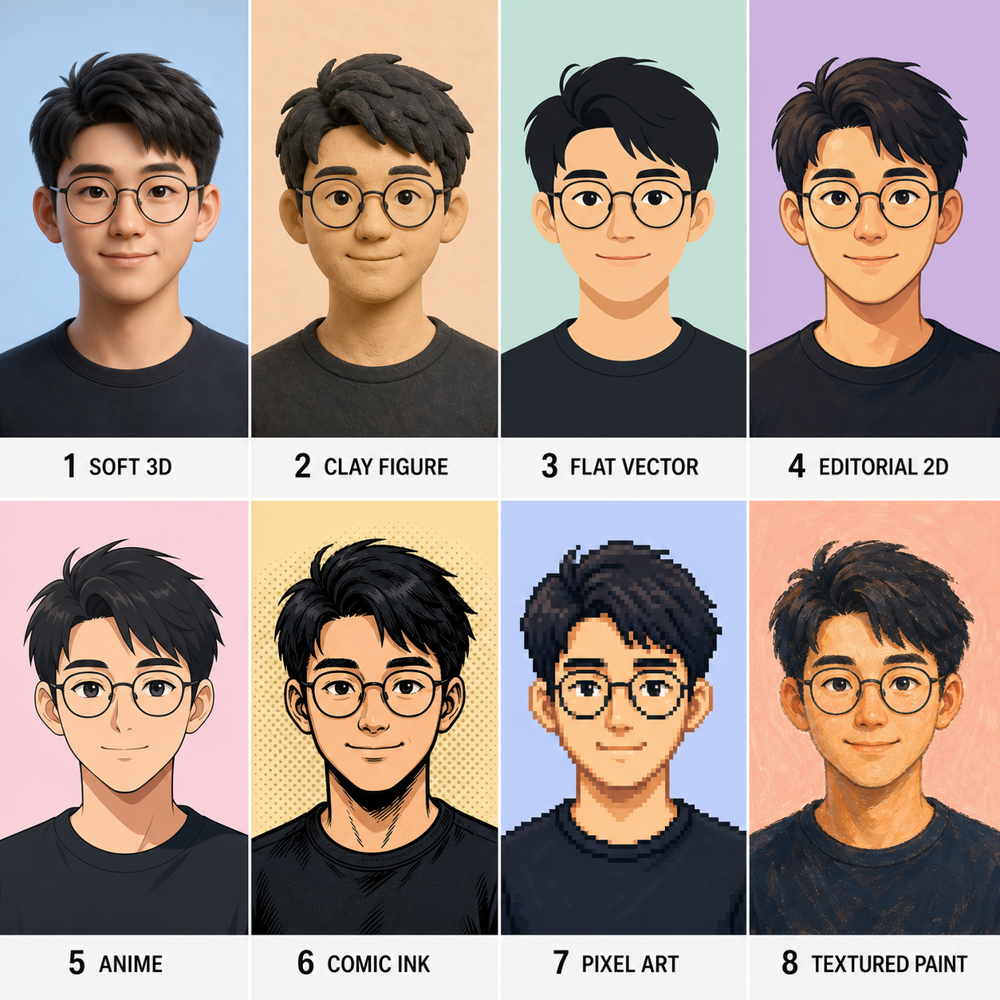

<p align="center"><a href="./README.md">简体中文</a> | <b>English</b></p>

# generate-avatar

One-line summary: this Skill helps you turn a portrait, a style reference, or a text-only brief into a cartoon avatar for Xiaohongshu, X, GitHub, and other social platforms.

## What this version can do

- Clarify the target platform, impression, framing, background, and delivery needs.
- Work from a portrait, a portrait plus style reference, or a text-only fictional/persona brief.
- Generate four square avatar candidates and refine the selected direction.
- Show a built-in style board when the user is unsure which visual direction to choose.
- Deliver a final square avatar, with optional circular previews, platform sizes, and a reusable generation prompt.

## Who it is for

- People who want a cleaner profile picture for social accounts or personal branding.
- Users who want a cartoon avatar from a photo without writing detailed image prompts.
- Creators who need an avatar that remains recognizable at small sizes.

## Usage example

Use the built-in style board to choose a direction:



Example request:

```text
Use generate-avatar to turn this portrait into a clean cartoon avatar for GitHub.
Keep it professional, with no text and no busy background.
```

Expected result:

- Four square avatar candidates.
- A refinement pass on the chosen candidate, such as lighter background or more visible glasses.
- One final square avatar, with optional platform-sized exports.

## Quick start

Install as a Codex Skill:

```bash
git clone https://github.com/hankchn/generate-avatar.git
mkdir -p ~/.codex/skills/generate-avatar
cp -R generate-avatar/{SKILL.md,agents,assets,references} ~/.codex/skills/generate-avatar/
```

Restart your Codex session, then ask:

```text
Use generate-avatar to create a cartoon avatar for my Xiaohongshu profile.
```

## Common uses

- Use a portrait and preserve face shape, hairstyle, glasses, skin tone, and distinctive features.
- Use one image as the identity reference and another as the style reference.
- Create a fictional avatar from a text-only description.
- Export a circular preview or platform-sized PNG after the final avatar is selected.

## Current limitations

- Without a supplied portrait, the output should not be described as resembling the user.
- Results depend on the image-generation model available in the current session.
- The default deliverable is an avatar, not a full social-profile identity system.
- Blurry, heavily occluded, or extreme-angle portraits reduce identity preservation.

## Security and privacy

- Do not use generated avatars for identity verification, documents, impersonation, or misleading contexts.
- Only use portraits that you have permission to use.
- This Skill does not need account passwords, API keys, or platform login credentials.

## Technical notes

- `SKILL.md` defines the avatar workflow, clarification rules, and safety boundaries.
- `assets/avatar-style-board.png` helps users choose a visual direction.
- `references/` contains platform delivery notes, prompt templates, and style guidance.

## License

[MIT](./LICENSE)

## Contributors

<table>
  <tr>
    <td align="center">
      <a href="https://github.com/hankchn">
        
        <br />
        <sub><b>hankchn</b></sub>
      </a>
      <br />
      <sub>Hank Yang</sub>
    </td>
    <td align="center">
      <a href="https://openai.com/codex">
        
        <br />
        <sub><b>Codex</b></sub>
      </a>
      <br />
      <sub>OpenAI Codex</sub>
    </td>
  </tr>
</table>
